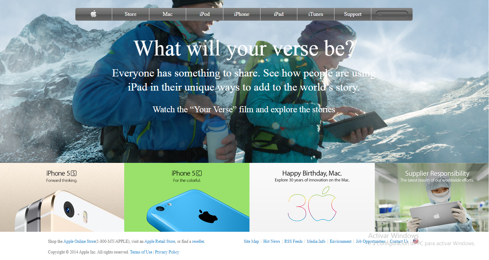

# Building-with-Backgrounds-and-Gradients
This is the fourth project of the Microverse HTML and CSS Curriculum. The project consists of a clone of an old version of Apple's web page.

## Screenshots

## Live Demo
https://raw.githack.com/Blasco9/Building-with-Backgrounds-and-Gradients/development/index.html

## Built with
- HTML5
- CSS3

## Author
This project was created by me [Blasco9](https://github.com/Blasco9)
